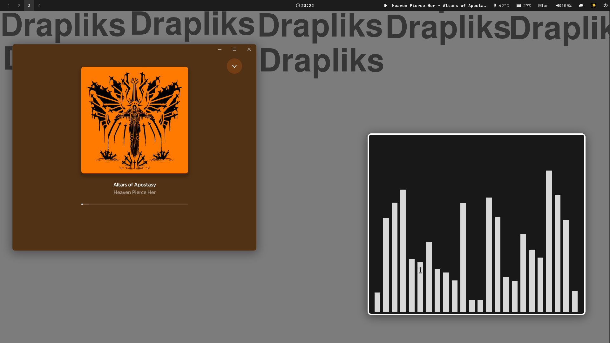
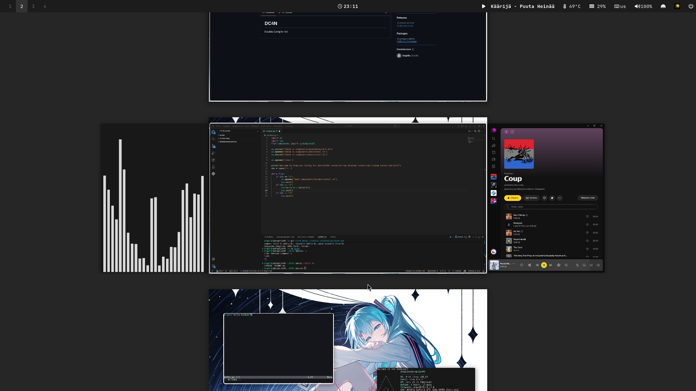
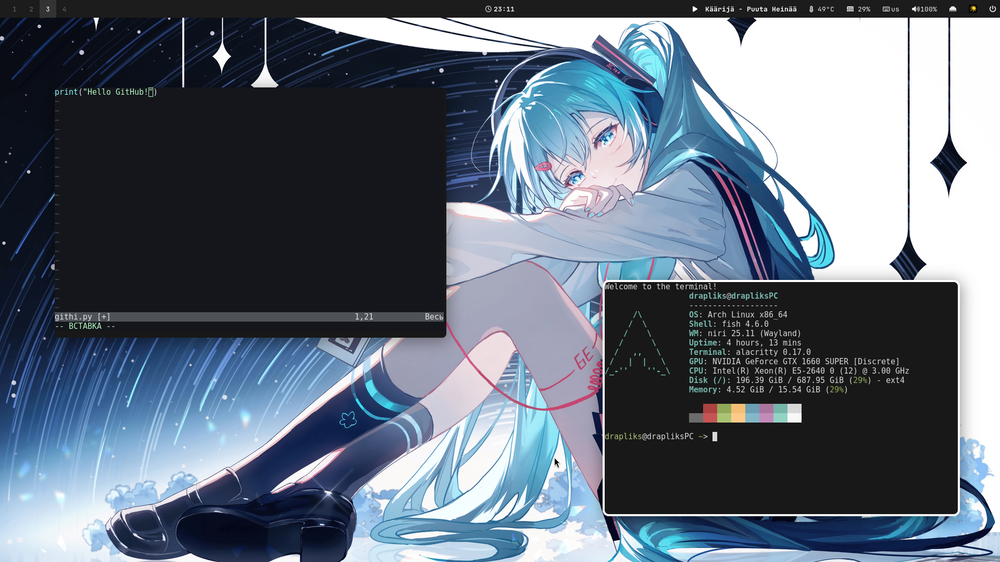
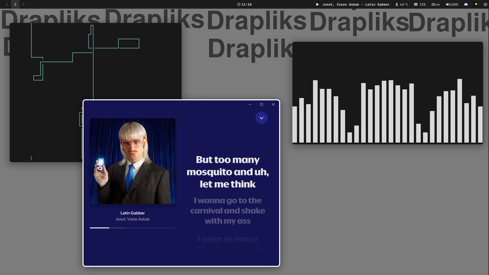

<div align="center">

[](https://niri-wm.github.io/niri/)
[](https://github.com/Drapliks/DC4N/blob/main/LICENSE)

# DC4N
Drapliks Config for Niri

</div>

# Packages
Base packages:
```
pulseaudio fish pipewire xdg-desktop-portal-gnome papirus-icon-theme btop mpv wine pipewire-pulse flatpak pipewire-alsa pipewire-jack wireplumber swww ttf-jetbrains-mono-nerd viewnior ttf-font-awesome otf-font-awesome gnome-themes-extra niri-settings-git alacritty mako swaybg swaylock waybar xwayland-satellite thunar nwg-look xdg-desktop-portal-gtk zen-browser-bin pipes.sh yay
```
Dev packages:
```
unityhub visual-studio-code-bin gimp neovim dotnet-sdk
```
Music packages:
```
yandex-music cava
```
# Base keybinds:

| Action | Keybinding |
|:--- |:--- |
| **Open terminal** | <kbd>Super</kbd> + <kbd>T</kbd> |
| **Close Window** | <kbd>Super</kbd> + <kbd>Q</kbd> |
| **App menu** | <kbd>Super</kbd> + <kbd>D</kbd> |
| **File manager** | <kbd>Super</kbd> + <kbd>E</kbd> |
| **Browser** | <kbd>Super</kbd> + <kbd>B</kbd> |
| **Floating toggle** | <kbd>Super</kbd> + <kbd>V</kbd> |
| **Maximize Column** | <kbd>Super</kbd> + <kbd>F</kbd> |
| **Fullscreen** | <kbd>F11</kbd> |
| **Up workspace** | <kbd>Super</kbd> + <kbd>PgUp</kbd> |
| **Down workspace** | <kbd>Super</kbd> + <kbd>PgDn</kbd> |
| **Exit Session** | <kbd>Super</kbd> + <kbd>Shift</kbd> + <kbd>E</kbd> |


# Screenshots:
|  |  |
| :---: | :---: |
|  |  |
